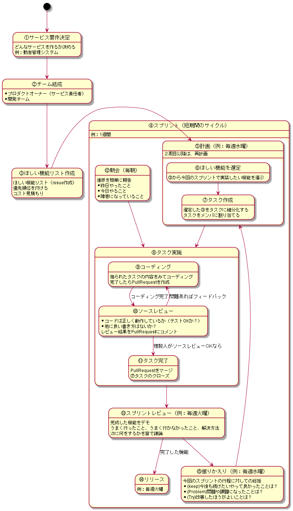

# PhpStormを使ったモダンなチーム開発ハンズオン

## 日時
3/10(日) 13:00～18：00

## はじめに
近年主流となっております「アジャイル型開発」をPhpStormという
統合開発ツールを用いて体験していただくという内容になっております。

チーム開発で必要となるタスク管理及びソース管理はGitHubを使用します。
また、作成したコードの動作確認を行う開発環境としてDockerを使用します。

PhpStormからGitHubのタスク操作やDockerの操作を直観的にできますので、
GitやDockerの知識はそれほど必要ではありません。

## このハンズオンに参加して身につくこと
- アジャイル型開発の基礎を習得することができる
- PhpStormでphpやhtml等のコード修正ができるようになる
- PhpStormでGitによるソース管理ができるようになる
- PhpStormでGitHubのタスク操作ができるようになる
- PhpStormでDocker操作ができるようになる

## 講座までにあらかじめ準備してもらう内容（必須）
- GitHubアカウントの取得
    - 取得していただいたアカウントをプロジェクト参加させるのに使用します。
    - https://github.com/join?source=header-home
- Git インストール
    - ソース管理で使用します。
    - windowsのかた
        - https://gitforwindows.org/
    - macのかた
        - https://tracpath.com/bootcamp/git-install-to-mac.html
- PhpStormインストール
    - 有料ですが、1か月はトライアルできます。
    - https://www.jetbrains.com/phpstorm/download/#section=windows
    - pluginインストール
        - PlantUML integration
            - 各種ドキュメントを見たり作成したりするのに必要です。
            - https://plugins.jetbrains.com/plugin/7017-plantuml-integration
        - PHP Docker & Docker integration
            - 開発環境で使用します。
            - https://plugins.jetbrains.com/plugin/8595-php-docker
            - https://plugins.jetbrains.com/plugin/7724-docker-integration
- Dockerインストール
    - 開発環境で使用します。
    - Windowsのかたは、まずこちらを読んで、インストール可能かご確認ください。
        - http://docs.docker.jp/windows/step_one.html
        - Windows10 Home Edition(64bit)のかたはこちら
           - https://qiita.com/idani/items/fb7681d79eeb48c05144
    - macのかた
        - https://hub.docker.com/editions/community/docker-ce-desktop-mac

## 開発フロー
スマホでタイムカードを押したりするシンプルな「勤怠管理システム」を題材に、
下記の手順で「アジャイル型開発」を体験します。

本ハンズオンでは、一通りのフローを終わらせ、現在ベータ版がリリースされた状態からスタートします。
チームで2回目のスプリント（「④計画」から「⑧振り返り」＆「⑨リリース」）までを4時間程度で行っていきます。

フロントエンジニア向けのタスク、サーバエンジニア向けのタスクを難易度別に用意しますので、
個人のスキルセットに合わせて、お選びいただく形となります。

## 現状のサービス

## タイムスケジュール

|時間         |内容                 |
|-------------|---------------------|
|13:00 - 13:30|概要説明             |
|13:30 - 14:15|メンバー自己紹介・PhpStorm等設定確認|
|14:15 - 14:30|休憩                 |
|14:30 - 14:45|④計画               |
|14:45 - 15:30|タスク消化           |
|15:30 - 15:45|休憩                 |
|15:45 - 16:30|タスク消化           |
|16:30 - 16:45|休憩                 |
|16:45 - 17:00|⑧リリース           |
|17:00 - 17:30|⑨振り返り           |
|17:30 - 18:00|質問                 |
